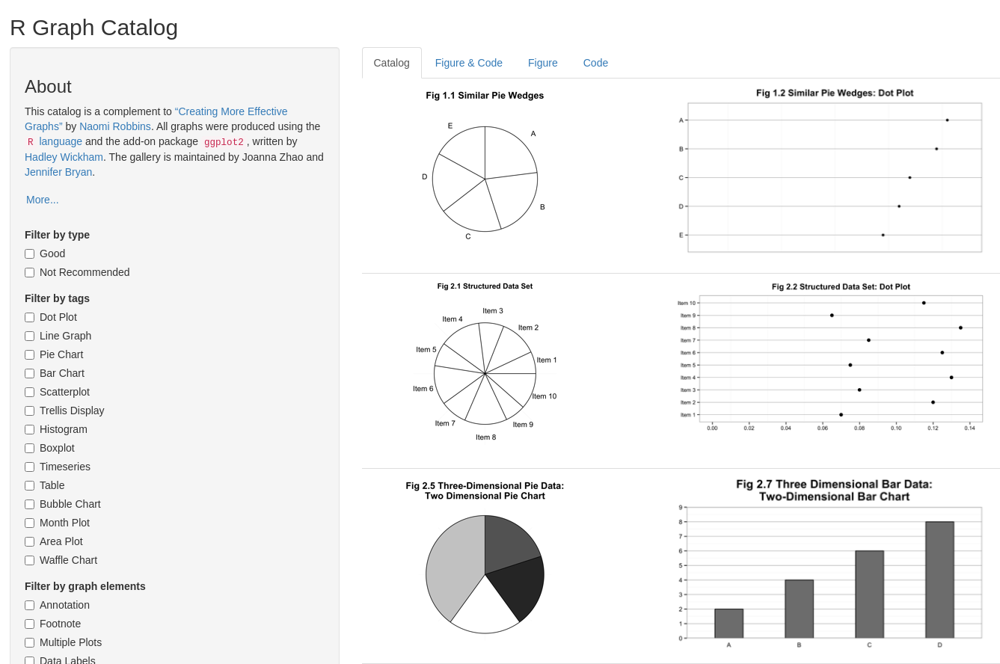
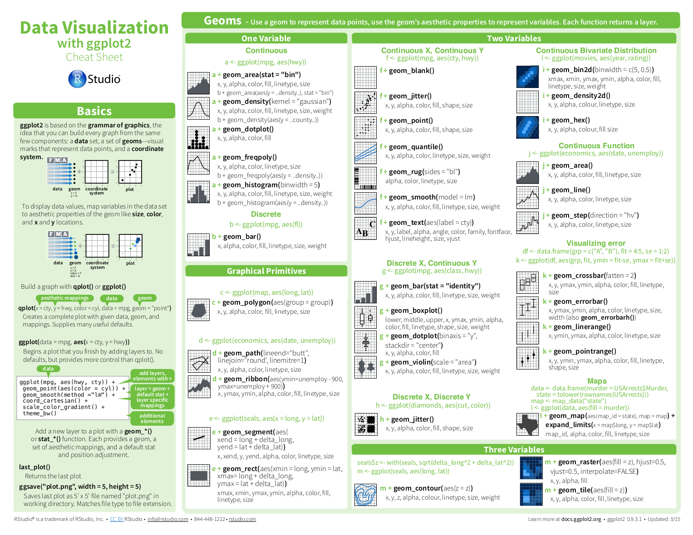

```{r setup, include=FALSE}
options(htmltools.dir.version = FALSE)
knitr::opts_chunk$set(
  fig.path = "deps/grammar-of-graphics/",
  fig.width = 6, fig.height = 4, 
  out.width = "75%", 
  message = F, warning = F, dpi = 300)
```

## Setting up

```{r, message = F, warning = F}
library(tidyverse)
library(ggplot2)
library(palmerpenguins)

str(penguins)
```

---

## Grammar of Graphics?

A chart is a combination of **data** and 

- **mappings** between graphical elements and variables

- **layers** of geometric elements and statistical transformations

- **scales** that map values in the data to graphical elements

- **coordinate systems** (cartesian, polar)

- **facets** (small multiples) - mini charts for subsets of the data

- **themes** - style elements that don't represent data


---
## Scatterplot

.pull-left[
```{r, out.width = "100%"}
ggplot(data = penguins) + 
  geom_point(
    aes(x = body_mass_g, 
        y = bill_depth_mm))
```
]
.pull-right[

- mappings:
  - x axis position: body_mass_g
  - y axis position: bill_depth_mm
- layers: points
- scales:
  - body_mass_g    
(`r min(penguins$body_mass_g, na.rm = T)`, `r max(penguins$body_mass_g, na.rm = T)`) -> (0, 1)    
position along x space
  - bill_depth_mm    
(`r min(penguins$bill_depth_mm, na.rm = T)`, `r max(penguins$bill_depth_mm, na.rm = T)`) -> (0, 1)    
position along y space
- coordinate system: cartesian
- facets: none
- themes: default (grey)

]

---
## Scatterplot with Color!

.pull-left[
```{r, out.width = "100%"}
ggplot(data = penguins) + 
  geom_point(
    aes(x = body_mass_g, 
        y = bill_depth_mm,
        color = species))
```
]
.pull-right[

- mappings:
  - x axis position: body_mass_g
  - y axis position: bill_depth_mm
  - .cerulean[color: species]
- layers: points
- scales:
  - .cerulean[Adelie = red, Chinstrap = green, Gentoo = blue]
- coordinate system: cartesian
- facets: none
- themes: default (grey)

]

---
## Bar Chart

.pull-left[
```{r, out.width = "100%", fig.height = 6}
ggplot(data = penguins) + 
  geom_bar(
    aes(x = island, 
        fill = species))
```
]
.pull-right[

- mappings:
  - x axis position: Island
  - y axis position: count**, stack groups together
  - fill: species
- statistics:
  - `stat_count`
- layers: points
- scales:
  - Adelie = red, Chinstrap = green, Gentoo = blue
- coordinate system: cartesian
- facets: none
- themes: default (grey)

]

---
## Bar Chart

.pull-left[
```{r, out.width = "100%", fig.height = 6}
ggplot(data = penguins) + 
  geom_bar(
    aes(x = island, 
        fill = species),
    position = "dodge2")
```
]
.pull-right[

- mappings:
  - x axis position: Island
  - y axis position: count**, put groups side-by-side
  - fill: species
- statistics:
  - `stat_count`
- layers: points
- scales:
  - Adelie = red, Chinstrap = green, Gentoo = blue
- coordinate system: cartesian
- facets: none
- themes: default (grey)

]

---
## Bar Chart

.pull-left[
```{r, out.width = "100%", fig.height = 6}
ggplot(data = penguins) + 
  geom_bar(
    aes(x = island, 
        fill = species),
    position = 
      position_dodge2(
        preserve="single"
      )
  )
```
]
.pull-right[

- mappings:
  - x axis position: Island
  - y axis position: count**,    
  put groups side-by-side    
  (all columns same width)
  - fill: species
- statistics:
  - `stat_count`
- layers: points
- scales:
  - Adelie = red, Chinstrap = green, Gentoo = blue
- coordinate system: cartesian
- facets: none
- themes: default (grey)

]

---
## Finding your Geom

[](https://shiny.srvanderplas.com/r-graph-catalog/#)
[](https://rstudio.com/wp-content/uploads/2015/03/ggplot2-cheatsheet.pdf)
