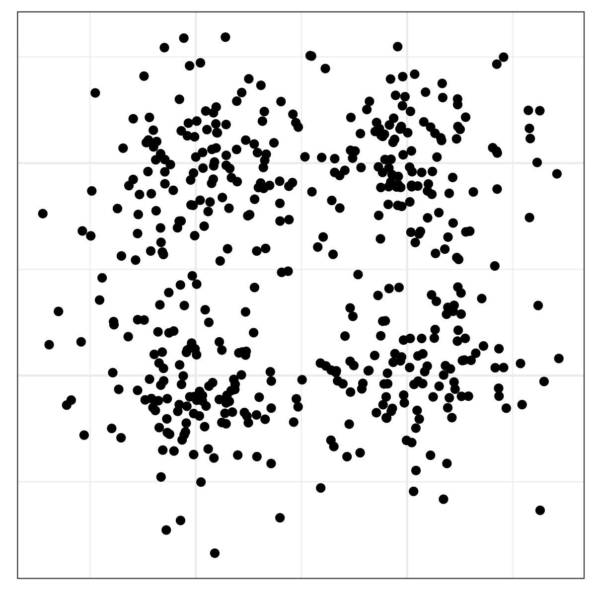
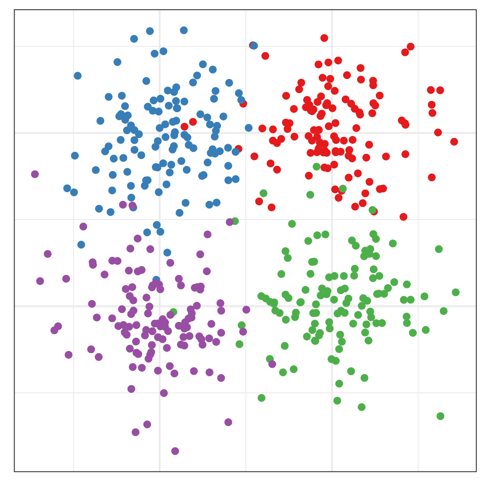

```{r setup, include=FALSE}
options(htmltools.dir.version = FALSE)
knitr::opts_chunk$set(
  echo = F,
  fig.path = "deps/lazy-graphics/",
  fig.width = 6, fig.height = 6, 
  out.width = "75%", 
  message = F, warning = F, dpi = 300)
library(tidyverse)
```

class: inverse
# Questions To Start With

.middle.center.cerulean.emph.huge[

What do I want to show?

What features of my data are important?

What is my audience?

]

---

## What do I want to show?


---

## What do I want to show?

```{r prox-sim, include = F, fig.width = 4, fig.height =4}
N <- 120
sigma <- .27
data <- data.frame(
  x = c(rnorm(N, 4, sigma), 
        rnorm(N, 3, sigma),
        rnorm(N, 4, sigma), 
        rnorm(N, 3, sigma)),
  y = c(rnorm(N, 4, sigma), 
        rnorm(N, 4, sigma), 
        rnorm(N, 3, sigma), 
        rnorm(N, 3, sigma)),
  group = rep(c("A", "B", "C", "D"), each = N)
)

library(ggplot2)
qplot(data = data, x = x, y = y) + theme_bw() + theme(axis.title = element_blank(), axis.text = element_blank(), axis.ticks = element_blank())
qplot(data = data, x = x, y = y, color = group) + scale_color_brewer(palette = "Set1", guide = "none") + theme_bw() + theme(axis.title = element_blank(), axis.text = element_blank(), axis.ticks = element_blank())
```

Proximity | Proximity + Similarity
-------- | -------
 | 

---

## What do I want to show?

```{r, out.width = "49%", include = T}
Titanic <- Titanic %>%
  as_tibble()

ggplot(data = Titanic) + 
  geom_bar(aes(x = Class, fill = Survived, weight = n), position = "dodge") + ggtitle("Class on the Titanic")

ggplot(data = Titanic) + 
  geom_bar(aes(x = Survived, fill = Class, weight = n), position = "dodge") + ggtitle("Who Survived the Titanic?")
```

- The arrangement of graphical elements makes some comparisons less mental work

- Your graph should highlight the comparisons you think are most important

---

## What features are important?

.center[

]

.bottom[From Cleveland & McGill (1986)]


---
## What features are important?

.cerulean.emph[Easiest to perceive accurately]

1. Position (common scale)
2. Position (non-aligned scale)
3. Length, Direction, Angle, Slope
4. Area
5. Volume, Density, Curvature
6. Shading, Color saturation, Color Hue

.cerulean.emph[Hardest to perceive accurately]


Important features should be shown using more accurate mappings

---
## What features are important?

```{r, out.width = "33%", include = T}

ggplot(data = Titanic) + 
  geom_bar(aes(x = Class, fill = Survived, weight = n), position = "dodge") + ggtitle("Class on the Titanic")

Titanic %>%
  group_by(Class, Survived) %>%
  summarize(n = sum(n)) %>%
  summarize(pct_survived = weighted.mean(Survived == "Yes", w = n), n = sum(n)) %>%
ggplot() + 
  geom_bar(aes(x = Class, fill = Class, color = Class, 
               alpha = pct_survived, weight = n), 
           position = "stack") +
  ggtitle("Survival by Class on the Titanic")


ggplot(data = Titanic) + 
  geom_bar(aes(x = Class, fill = Survived, weight = n), position = "fill") + ggtitle("Class on the Titanic")

```

- Using color saturation to show survival is harder to read accurately

- Using position on an aligned scale to show survival by class status is much easier to read

- If we want to show survival rates by class, we could use stacked bars (but we lose # individuals)

---

## What is my audience?
.toprightfig[]
- 10% of men and 0.2% of women are colorblind

Ways to work around colorblindness:

- Use redundant encoding (e.g. shape + color)

- Use colorblind safe color schemes
  - Totally safe: 
      - orange and purple
      - black-and-white copier friendly

  - Maybe safe:
      - [ColorBrewer](https://colorbrewer2.org/) color schemes
      - `dichromat` package color schemes

  - General rule
      - use light/dark perception to your advantage    
      (vary saturation and hue)


---
## Perceptual quirks

Keep in mind that we don't always perceive things accurately

Color perception | Length perception
----- | -----
 | 

- Context matters!
- Induced context (the sine curve looks like a ribbon) can make it difficult to see that the lines are the same length
